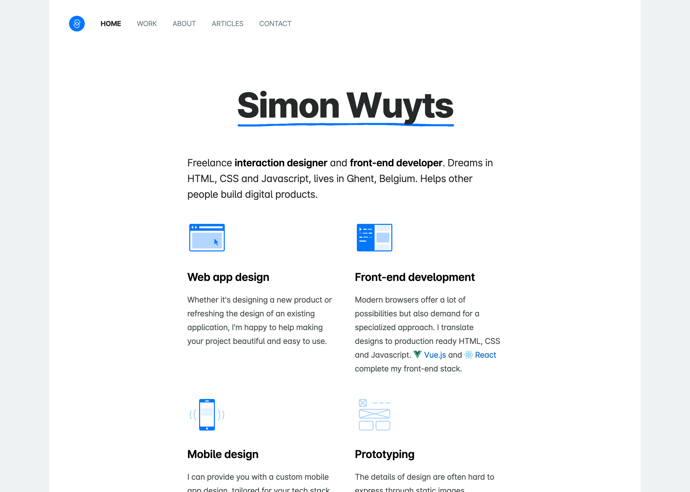

# Portfolio Website

This is the source code of my personal website, [simonwuyts.com](https://www.simonwuyts.com).

---

Making this website would have been a lot harder without these wonderful open-source projects:

- [Vue.js](https://github.com/vuejs/vue)
- [Nuxt.js](https://github.com/nuxt/nuxt.js/)
- [Nuxt payload extractor](https://github.com/DreaMinder/nuxt-payload-extractor)
- [Directus](https://github.com/directus/directus)

If you have any questions about this website, feel free to [send me a message](mailto:hi@simonwuyts.com).
